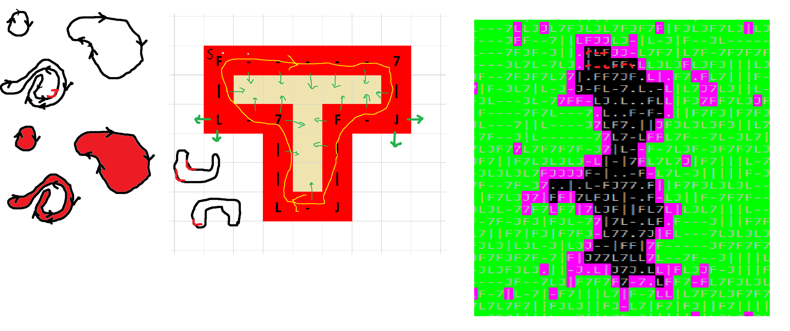
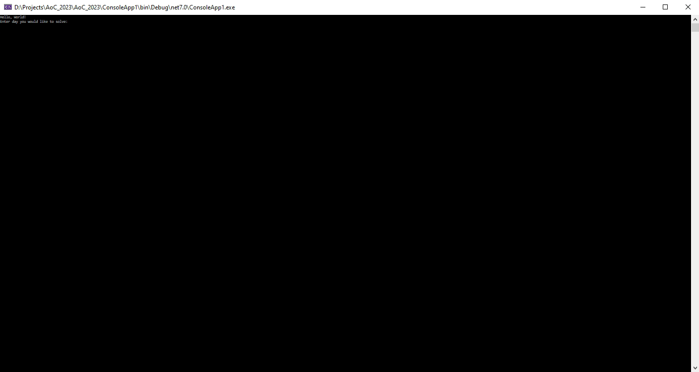

# Advent Of Code 2023
Here are my solutions to the advent of code 2023. I was on vacation for christmas, so have just completed up to day 18. I have highlighted my favourite moments below.

You can fork the repository and try the results yourself, however, you will need to use your own input files, as AoC strictly forbids these from being shared.

To run, add the input for a day in to its directory with the name inputs.txt. for example for day 1 save the inputs a text file /ConsoleApp1/Day1to9/Day1/inputs.txt. Run the programm and then type the number of the day you would like to solve.

# Highlights

## Day 10
In Day 10 we were given an input that specified a loop in a 2d grid, which we had to find the filled area of. These drawings below show how I came up with my algorith.

First it was necessary to understand what being inside a loop meant. For example, looking at the snake like loop on the left of the figure, it can be seen that being surrounded on all sides by a boundary, is not enough to say that the given square is inside the loop (see the white area within the coiled snake).
However, by drawing directional arrows on the boundary (giving it an orientation), I was able to see that squares within the loop are always on the right of the arrow, with respect to the arrows current direction.
I then transfered this understanding over to an excel sheet to see how it worked for our loop with its orthogonal directions.

This process gave me, as it were, the boundary of the filling (the purple squares).
To complete the fill algorithm I filled each line, starting at a purple square, and filling from left to right.

